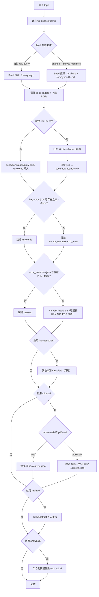

# Topic CLI Pipeline（以主題驅動的端到端串接）

本文件描述本 repo 目前「可落地」的端到端 pipeline，目標是：**只要給一個 `topic`，就能用 CLI 一鍵串接**從 seed surveys →（可選）filter-seed → 關鍵詞抽取 → metadata harvest →（可選）criteria →（可選）LatteReview 初篩 →（可選）ASReview + snowballing。

> 重要：此 pipeline 只做「串接與落盤」，底層功能全部重用既有模組（`src/utils/*`），不修改受保護檔案（見 `docs/agent-protected-files.md`）。

---

## 1. 你要解決的痛點（問題定義）

目前 repo 的能力主要散落在：
- `src/utils/paper_workflows.py`：搜尋（arXiv / Semantic Scholar / DBLP）與下載整合
- `src/utils/keyword_extractor.py`：讀 PDF → 抽 `anchor_terms` / `search_terms`
- `src/utils/structured_web_search_pipeline.py`：web search → 產生 structured criteria JSON
- `resources/LatteReview/`：Title/Abstract reviewer workflow（live OpenAI）
- `test/speech_lm_results_to_asreview.py`：LatteReview 結果 → ASReview CSV + snowballing

但若沒有「單一入口」把以上串起來，你就會卡在：
- 能跑單一測試主題（例如 Speech LM）並產生 `test_artifacts/`，但**無法用參數化方式改主題重跑**。
- 產物散在 `test_artifacts/`，**缺少固定的 workspace layout**，很難用下游流程接續做事。

---

## 2. 新增的串接入口（CLI）

本 repo 已新增一個 CLI：
- `scripts/topic_pipeline.py`

它會把所有產物寫入 workspace（預設 `workspaces/<topic_slug>/`），避免再把「正式工作資料」塞進 `test_artifacts/`。

> 注意：`--topic` 可放在 subcommand 前或後（例如 `seed --topic ...` 或 `--topic ... seed` 都可）。

### 2.1 Workspace 目錄結構（固定）

以 `--topic "speech language model"` 為例，`topic_slug` 會被正規化（英數/中文保留，其餘轉 `_`）：

```
workspaces/speech_language_model/
  config.json
  seed/
    queries/
      arxiv.json
      seed_selection.json
    downloads/
      download_results.json
      arxiv_raw/*.pdf                  # filter-seed 前的原始下載（可選）
      arxiv/*.pdf                      # 供 keywords 使用的 PDFs
    filters/                           # filter-seed 才會有
      llm_screening.json
      selected_ids.json
  keywords/
    keywords.json
    keyword_extractor_usage_<timestamp>.json
  harvest/
    arxiv_metadata.json
    semantic_scholar_records.json      # 可選
    dblp_records.json                  # 可選
  criteria/
    criteria.json                      # 可選（內含 structured_payload）
    web_search_notes.txt
    pdf_background.txt                 # pdf+web 才會有
    combined_notes.txt                 # pdf+web 才會有
    formatter_prompt.json              # pdf+web 才會有
    formatter_raw.txt                  # pdf+web 才會有
  review/
    latte_review_results.json          # 可選
  asreview/
    screening_included.csv             # snowball 產物
    snowball_results.csv
    snowball_for_review.csv
```

> `.gitignore` 已新增 `workspaces/`，避免 PDF 與大量 artefacts 被誤提交。

### 2.2 Pipeline 流程圖（概念版）



---

## 3. Pipeline 分段與對應模組

### Stage A：Seed Surveys（arXiv）

目的：先找到「綜述/回顧」類 PDF，給 keyword extractor 當輸入。

- API：`paper_workflows.search_arxiv_for_topic` → `paper_workflows.download_records_to_pdfs`
- CLI：
  - `python scripts/topic_pipeline.py seed --topic "<topic>"`
  - 若要對齊「title token AND」的查詢邏輯，可用：
    - `python scripts/topic_pipeline.py seed --topic "<topic>" --scope ti --anchor-mode token_and`
  - 若要完全自行控制 arXiv 的 `search_query`（將忽略 anchors/survey_terms 等參數）：
    - `python scripts/topic_pipeline.py seed --topic "<topic>" --arxiv-raw-query 'ti:("discrete" AND "audio" AND "token") AND (survey OR review)'`
- 輸入：
  - `topic`
  - `anchor_terms`：未提供時，會使用 `default_topic_variants(topic)` 產生搜尋用變體
  - `survey_terms`：未提供時預設為 `survey/review/overview/systematic review/systematic literature review/scoping review/mapping study/tutorial`
- 產物：
  - `seed/queries/arxiv.json`
  - `seed/queries/seed_selection.json`（cutoff candidate、cutoff date、實際下載清單）
  - `seed/downloads/download_results.json`
  - `seed/downloads/arxiv/*.pdf`
- 分歧/特殊情況：
  - `--arxiv-raw-query` 非空 → 直接使用 raw query，忽略 anchors/survey_terms/scope/boolean_operator。
  - 既有 `seed/queries/arxiv.json` 且未加 `--no-cache` → 直接重用 cache，不重新查詢。
  - `anchor_terms` 或 `survey_terms` 為空 → 直接報錯。
  - 相似標題 cutoff（預設啟用）：
    - 會對搜尋到的 survey 標題計算與 `topic` 的相似度。
    - 若找到相似度 ≥ 門檻（預設 0.8）的 survey，會排除該篇並只保留更早發表的 surveys 來下載/抽關鍵字。
    - 可用 `--no-cutoff-by-similar-title` 關閉，或用 `--similarity-threshold` 調整門檻。

### Stage A.5（可選）：Filter-Seed（LLM 審核）

目的：在進入 keyword extraction 前，讓 LLM 根據 **title + abstract** 判斷是否保留該 seed paper。  
（採用方案 A：**整理 `seed/downloads/arxiv/`，不改 keywords 介面**）

- CLI：
  - `python scripts/topic_pipeline.py filter-seed --topic "<topic>"`
- 輸入：
  - `seed/downloads/arxiv/*.pdf` 或 `seed/downloads/arxiv_raw/*.pdf`
  - `--include-keyword`（可重複）作為提示詞的加權關鍵字
- 產物：
  - `seed/filters/llm_screening.json`
  - `seed/filters/selected_ids.json`
  - `seed/downloads/arxiv_raw/*.pdf`（原始下載）
  - `seed/downloads/arxiv/*.pdf`（僅保留 LLM 判定 yes）
- 分歧/特殊情況：
  - 若 `llm_screening.json` 與 `selected_ids.json` 已存在且未 `--force` → 直接跳過。
  - 若 `arxiv_raw/` 為空但 `arxiv/` 有 PDF → 先把 `arxiv/*.pdf` 移到 `arxiv_raw/` 再進行篩選。
  - 只使用 title + abstract：**必須明確是 survey/review/overview** 才可保留；若不確定必須回覆 `no`；且必須與主題高度相關。
  - 完成後會清空 `seed/downloads/arxiv/`，只拷貝通過的 PDFs。

### Stage B：Keyword Extraction（從 surveys 抽取 anchor/search terms）

目的：讀取 seed PDFs，輸出：
- `anchor_terms`：主題的穩定錨點（例如同義詞/縮寫）
- `search_terms`：依分類整理的 query term（之後做 harvest）

- API：`keyword_extractor.extract_search_terms_from_surveys`
- CLI：
  - `python scripts/topic_pipeline.py keywords --topic "<topic>"`
- 產物：
  - `keywords/keywords.json`
  - `keywords/keyword_extractor_usage_<timestamp>.json`
- 分歧/特殊情況：
  - 若 `keywords.json` 已存在且未 `--force` → 直接跳過（回傳 `skipped`）。
  - 會硬鎖 `model=gpt-5.2`、`temperature=1.0`（CLI 參數仍可輸入但會被忽略）。
  - `ExtractParams.use_topic_variants=False`：不把 topic 變體注入到 anchor 候選。
  - Prompt 規則（直接寫入提示詞）：
    - `topic_hint` 可能是研究領域或論文標題。
    - **不得輸出 `topic_hint` 本身**。
    - 若是論文標題型 topic，不可抄題、不可造縮寫。
    - 縮寫僅能來自 PDF/metadata，且必須與全稱同時輸出。
    - `anchor_terms` 必須出現在 title/abstract（大小寫不敏感），不可含標點，1–3 詞為限。
  - Anchor 清理策略（後處理）：
    - 若 `seed_anchors` 有值 → `anchor_terms` 直接改用其去重結果。
    - 否則會排除 topic 變體、去除標點、限制 1–3 詞，並**優先要求出現在 title/abstract corpus**；最多 4 個。
    - 若仍無結果，才會依序放寬條件或最終回退到 `topic`。
  - 若找不到任何 PDF（`seed/downloads/arxiv/` 為空）→ 直接報錯。

### Stage C：Metadata Harvest（arXiv）

目的：用 `anchor_terms × search_terms` 做大規模查詢，拉回可用於後續篩選的 metadata（並驗證 PDF 可存取）。

- API：`paper_workflows.search_arxiv_for_topic` → `paper_downloaders.fetch_arxiv_metadata` → `HEAD pdf_url`
- CLI：
  - `python scripts/topic_pipeline.py harvest --topic "<topic>" --start-date 2022-01-01 --end-date 2025-12-31`
- 產物：
  - `harvest/arxiv_metadata.json`
- 分歧/特殊情況：
  - 若 `arxiv_metadata.json` 已存在且未 `--force` → 直接跳過（回傳 `skipped`）。
  - `keywords.json` 缺 `anchor_terms` 或 `search_terms` → 直接報錯。
  - `search_terms` 會先依 `max_terms_per_category` 扁平化；若扁平化後為空 → 報錯。
  - `--start-date`/`--end-date` 會套用到 metadata 發表日期；若缺日期 → 排除該篇。
  - `--start-date` 晚於 `--end-date` → 直接報錯。
  - 預設要求 `pdf_url` 可 HEAD 存取；若不可存取或缺 `pdf_url` → 排除；可用 `--no-require-accessible-pdf` 關閉。

### Stage D（可選）：Other Sources Harvest（Semantic Scholar / DBLP）

目的：同樣用 keyword 組合抓其他來源的 records，供後續人工比對或補件。

- API：`paper_workflows.search_semantic_scholar_for_topic`、`paper_workflows.search_dblp_for_topic`
- CLI：
  - `python scripts/topic_pipeline.py harvest-other --topic "<topic>"`
- 產物：
  - `harvest/semantic_scholar_records.json`
  - `harvest/dblp_records.json`
- 分歧/特殊情況：
  - 可用 `--no-semantic-scholar` / `--no-dblp` 關閉個別來源。
  - 若對應輸出檔已存在且未 `--force` → 該來源會被跳過。

### Stage E（可選）：Criteria Consolidation（Web / PDF+Web）

目的：為後續 reviewer 準備一致的主題定義與納入/排除規則（structured JSON）。

- API：`structured_web_search_pipeline.run_structured_criteria_pipeline`
- CLI：
  - `python scripts/topic_pipeline.py criteria --topic "<topic>" --mode web --recency-hint "過去3年"`
  - `python scripts/topic_pipeline.py criteria --topic "<topic>" --mode pdf+web --max-pdfs 5`
- 產物：
  - `criteria/criteria.json`（內含 `structured_payload`）
  - `criteria/web_search_notes.txt`
  - `criteria/pdf_background.txt`、`criteria/combined_notes.txt`、`criteria/formatter_prompt.json`、`criteria/formatter_raw.txt`（僅 `pdf+web`）
- 分歧/特殊情況：
  - 若 `criteria.json` 已存在且未 `--force` → 直接跳過（回傳 `skipped`）。
  - `mode=web`：只產出 web notes + structured JSON。
  - `mode=pdf+web`：會讀取 PDFs（預設 `seed/downloads/arxiv/`，可用 `--pdf-dir` 指定），最多 `max_pdfs`。
  - 即使沒有任何 PDF，仍會組合 web notes 並進行 formatter（`pdf_background.txt` 會是空字串）。

### Stage F（可選）：LatteReview Title/Abstract 初篩

目的：用 LatteReview 三人 workflow 產出每篇 paper 的 `evaluation` 與 `final_verdict`。

- API：`resources.LatteReview.lattereview.workflows.ReviewWorkflow`
- CLI：
  - `python scripts/topic_pipeline.py review --topic "<topic>"`
- 輸入：
  - `harvest/arxiv_metadata.json`
  - `criteria/criteria.json`（若存在，會自動轉成 reviewer 的 inclusion/exclusion 字串）
- 產物：
  - `review/latte_review_results.json`
- 分歧/特殊情況：
  - 若 `OPENAI_API_KEY` 未設定 → 直接報錯。
  - 若 metadata 檔不存在 → 直接報錯。
  - 會略過 title/abstract 缺失者，或 title 含 `skip_titles_containing`（預設 "survey"）。
  - 若過濾後無可審核條目 → 直接報錯。
  - 若無 criteria（或無 `structured_payload`）→ 使用內建的預設 inclusion/exclusion 文字。

### Stage G（可選）：ASReview + Snowballing

目的：把 LatteReview 結果轉成 ASReview CSV，並進行 forward/backward snowball。

- 工具：`test/speech_lm_results_to_asreview.py`
- CLI：
  - `python scripts/topic_pipeline.py snowball --topic "<topic>" --email "<you@example.com>"`
- 產物：
  - `asreview/screening_included.csv`
  - `asreview/snowball_results.csv`
  - `asreview/snowball_for_review.csv`
- 分歧/特殊情況：
  - 若 snowball 腳本不存在或無 `main(argv)` → 直接報錯。
  - snowball 腳本回傳非 0 → 直接報錯。

---

## 4. 一鍵跑完整串接（建議先從這裡開始）

```bash
source sdse-uv/.venv/bin/activate
python scripts/topic_pipeline.py run --topic "speech language model" \
  --seed-max-results 25 \
  --seed-download-top-k 5 \
  --max-pdfs 3 \
  --max-terms-per-category 3 \
  --top-k-per-query 100 \
  --start-date 2022-01-01 \
  --end-date 2025-12-31 \
  --with-criteria \
  --criteria-mode pdf+web
```

若你希望一鍵連 LatteReview 與 snowball 也一起跑：

```bash
python scripts/topic_pipeline.py run --topic "<topic>" --with-criteria --with-review --with-snowball
```

補充行為（run 子命令）：
- 不會自動執行 filter-seed；如需先篩 seed，請額外跑 `filter-seed` 後再進入 keywords/harvest。
- seed 在 run 內固定使用 cache（`reuse_cached_queries=True`）；要重查請先單跑 `seed --no-cache`。
- `--extract-model` 仍會被 keywords 階段的硬鎖覆寫（實際模型固定 gpt-5.2）。
- `--force` 只影響 keywords/harvest/criteria 的主要輸出，不會清空 seed 的 query cache。

---

## 5. 先備條件（環境變數）

- 必要：`.env` 內有 `OPENAI_API_KEY`
  - 用途：filter-seed、keyword extraction（讀 PDF）、criteria、LatteReview
- 選用：`SEMANTIC_SCHOLAR_API_KEY`
  - 用途：提高 Semantic Scholar 查詢速率與減少 429

注意：本 repo 的工具會在執行時自動呼叫 `load_env_file()` 載入 `.env`，**不需要**你手動 `export`。

---

## 6. 測試要點

建議修改後至少驗證：

```bash
source sdse-uv/.venv/bin/activate
ruff check .
pytest -q test/unit/test_paper_workflows_queries.py
pytest -q test/unit/test_openai_provider_messages.py
```

> Live 測試（keyword extractor / web search / LatteReview）會直接呼叫 OpenAI API，成本與時間取決於外部服務狀態。

---

## 7. 已知限制

- `harvest` 目前以 arXiv 為主要 downstream 輸入（與現有 Speech LM pipeline 一致）。
- `review` 會把 structured criteria JSON 轉為字串；格式是「可用於 prompt」而不是機器可驗證的邏輯規則。
- `snowball` 目前沿用 `test/speech_lm_results_to_asreview.py`；若之後要變成正式模組，建議搬到 `src/` 並補上更通用的資料 schema。
