# Topic Pipeline 概念總覽（給人看的版本）

本頁以「概念流程」說明從 topic 出發的端到端 pipeline，避免呈現程式與函式細節，內容對齊目前已實作的行為與輸出。

---

## 核心目標

- 只要給一個 `topic`，即可穩定產出可用於後續文獻篩選與擴展的資料與清單。
- 全部輸出集中於單一 workspace，便於追蹤每一階段的輸入與成果。

---

## 相對原 pipeline 的新增/調整（概念版）

- **新增 Filter-Seed**：在 seed 與 keywords 之間加一道品質閘門，先以 title/abstract 篩掉不符合 survey/review/overview 且與主題不相符的條目。
- **強化 Keywords 規則**：`topic` 可能是研究領域或論文標題；若為論文標題不可抄題或造縮寫；`anchor_terms` 需源自 PDF/metadata。
- **Criteria 路徑擴充**：支援 `web` 與 `pdf+web` 兩種概念路徑（後者引入 seed PDFs 作為背景證據）。
- **Harvest 品質條件**：提供時間範圍與可取得全文的條件，以維持 downstream 可用性。

---

## 完整流程圖（概念版）

---

## 主要階段（概念版）

### A. Seed Surveys
- **輸入**：topic（可被視為研究領域或論文標題）
- **輸出**：seed PDFs（綜述/回顧/overview 類型）
- **分歧**：可用既定查詢或自訂查詢；若找不到符合條件的 seed，後續無法進入 keyword 抽取。

### A.5 Filter-Seed（可選）
- **輸入**：seed PDFs 的 title + abstract
- **輸出**：只保留「明確為 survey/review/overview 且主題高度相關」的 PDFs
- **分歧**：未啟用時直接跳過；啟用後會以 LLM 進行 yes/no 篩選。

### B. Keywords
- **輸入**：seed PDFs
- **輸出**：`anchor_terms` 與 `search_terms`
- **行為重點**：
  - `topic` 可能是研究領域或論文標題；若為論文標題，不能抄題或造縮寫。
  - `anchor_terms` 需從 PDF/metadata 內文抽取，不使用 topic 變體作為候選。
  - keywords 階段的模型與溫度設定固定，不會因使用者參數改動。

### C. Harvest（arXiv metadata）
- **輸入**：`anchor_terms × search_terms`
- **輸出**：可用於後續篩選的 metadata（含可存取 PDF 的檢查）
- **分歧**：可設定時間窗；不在時間窗或 PDF 不可存取的條目會被排除。

### D. Harvest-Other（可選）
- **輸入**：`anchor_terms × search_terms`
- **輸出**：其他來源的 metadata（如 Semantic Scholar / DBLP）
- **分歧**：可個別關閉特定來源。

### E. Criteria（可選）
- **輸入**：topic（web）或 topic + seed PDFs（pdf+web）
- **輸出**：結構化的納入/排除條件 JSON
- **分歧**：`web` 只用網路資料；`pdf+web` 會讀 seed PDFs 並與 web notes 合併。

### F. LatteReview（可選）
- **輸入**：metadata（可選 criteria）
- **輸出**：Title/Abstract 初篩結果
- **分歧**：若無可審核條目或缺少必要 API key，流程會停止。

### G. Snowball（可選）
- **輸入**：LatteReview 結果 + metadata
- **輸出**：迭代式 snowball（每輪含 LatteReview），round_XX 產物 + 全歷史 `review_registry.json` + `final_included.json/csv`
- **分歧**：若前一步無有效結果或必要腳本不可用，流程會停止。

---

## 輸出路徑（概念說明）

- 所有產物統一寫入同一個 workspace 目錄。
- 各階段會在各自子資料夾落盤，方便檢視與追蹤。
