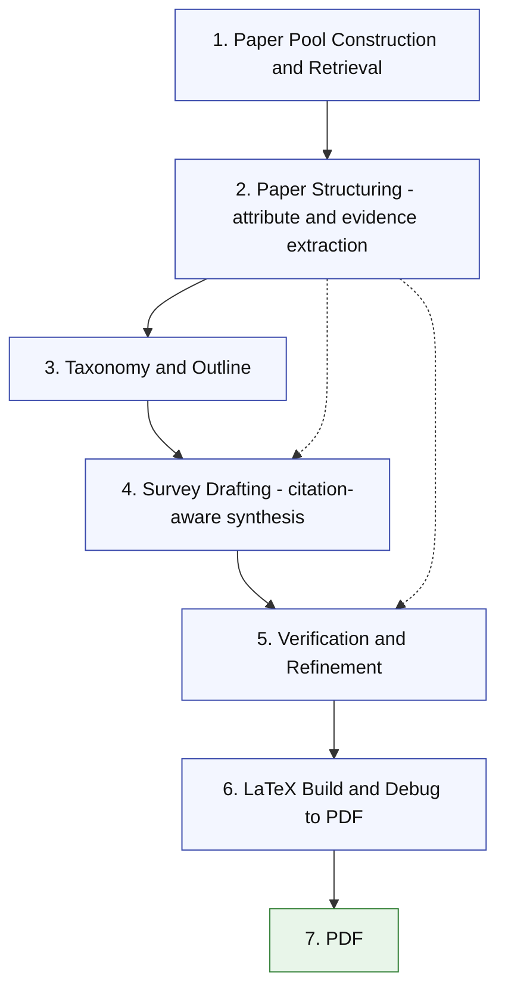
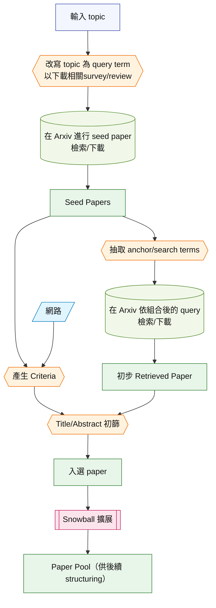

# Automatic Survey Generation 架構流程圖（概念版）

> 本文件為概念性流程圖，避免程式與函式細節；聚焦整體架構與資料流。

## A) 全貌流程圖（Automatic Survey Generation）

說明：
- 實線為主流程，虛線表示「Paper Structuring」的輸出同時支援撰寫與 refinement。

## B) Paper Pool Construction / Retrieval（現行 pipeline 細節）

形狀圖例：
- `正方形`：實際存在的 artifact（含入選 paper）
- `{{ }}`：Agent 參與
- `/ /`：網路
- `[( )]`：paper 資料庫（如 Arxiv）
- `[[ ]]`：Snowball 擴展流程

## C) 補充說明（與全貌對齊）

1. **Paper Pool Construction / Retrieval**：以 topic 觸發檢索與篩選，建立可用於綜述的候選 paper pool。
2. **Paper Structuring（attribute & evidence extraction）**：對候選論文做屬性與證據抽取，形成可被引用的結構化資訊。
3. **Taxonomy & Outline**：在結構化資訊基礎上產出分類與章節結構。
4. **Survey Drafting（citation-aware synthesis）**：結合結構化證據撰寫內容，保留可追溯的引用關係。
5. **Verification & Refinement**：根據證據與引用關係進行一致性檢核與修訂。
6. **LaTeX Build & Debug → PDF**：完成排版、除錯並輸出 PDF。
7. **PDF**：最終成果輸出。
