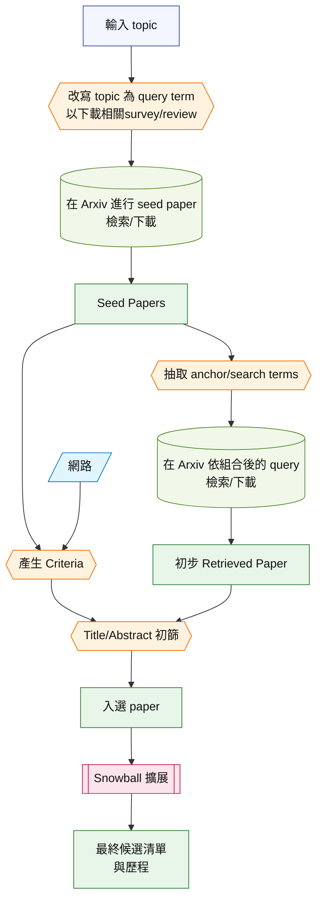
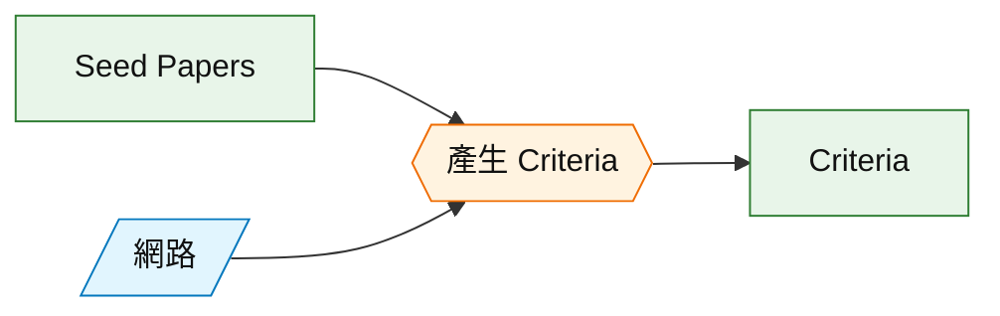
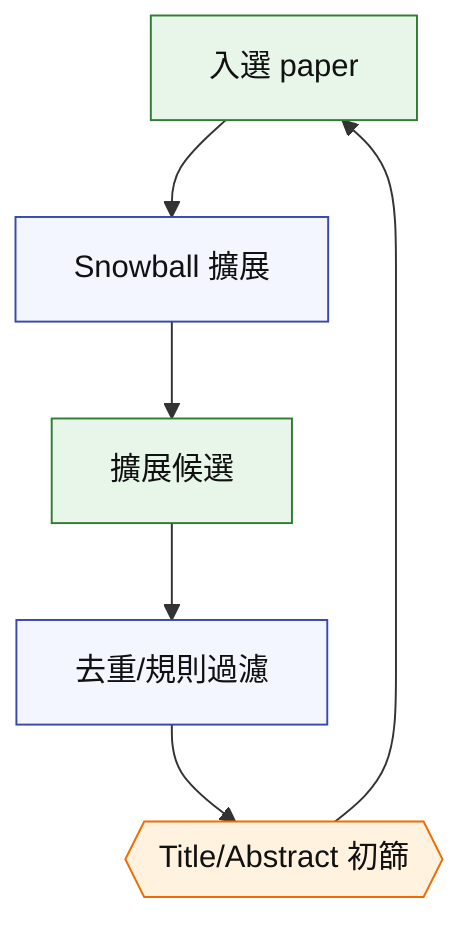
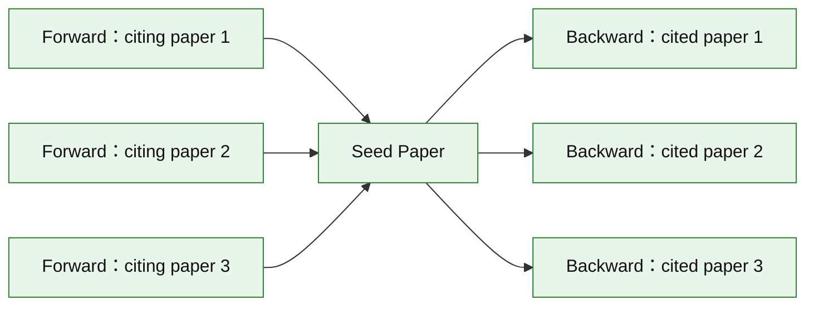
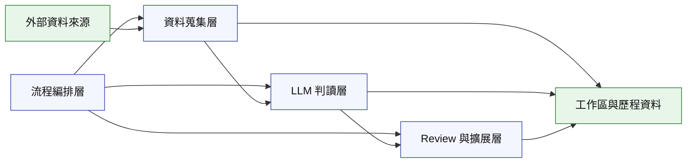

# AUTOSR-SDSE 架構概念報告（簡報版）

> 本報告為概念性介紹，刻意省略程式與函式細節，重點放在「流程一致的架構視角」。

## 1. 架構目標與設計原則

- **單一 topic 驅動**：以一個主題做為唯一入口，讓流程具備可重複性與可比較性。
- **流程模組化**：每個階段只處理明確任務，彼此以資料輸出銜接，避免跨階段耦合。
- **產出可追溯**：所有產物形成清楚的資料鏈，方便對照每一階段決策依據。
- **主流程清晰**：主流程不使用菱形分支，閱讀順序一致。

## 2. 全貌流程圖（精簡、可讀版）

形狀圖例：
- `正方形`：實際存在的 artifact（含入選 paper）
- `{{ }}`：Agent 參與
- `/ /`：網路
- `[( )]`：paper 資料庫（如 arXiv）
- `[[ ]]`：Snowball 擴展流程

## 3. 主要階段（概念說明）

### 3.1 改寫 topic 為 query term 以下載相關survey/review
- **目的**：把 topic 改寫為可用於 seed 搜尋的查詢詞。
- **輸入**：topic。
- **輸出**：seed query term。

### 3.2 在 Arxiv 進行 seed paper 檢索/下載（固定）
- **目的**：取得主題相關的綜述性文獻作為 seed（需標注為 survey）。
- **輸入**：seed query term。
- **輸出**：seed papers（survey）。

### 3.3 抽取 anchor/search terms
- **目的**：從 seed papers 抽取主題的 anchor/search terms。
- **輸入**：seed papers（survey）。
- **輸出**：結構化的關鍵詞集合與分類。

### 3.4 在 Arxiv 依組合後的 query 檢索/下載
- **目的**：依 anchor/search terms 從 arXiv 檢索與下載候選論文。
- **輸入**：關鍵詞集合。
- **輸出**：初步 Retrieved Paper。

### 3.5 Criteria
- **目的**：建立一致的納入/排除標準，以提升後續審查一致性。
- **輸入**：seed papers 與網路資訊。
- **輸出**：結構化的條件描述。

### 3.6 Review
- **目的**：以 Title/Abstract 作為第一輪審查依據，快速縮小範圍。
- **輸入**：初步 Retrieved Paper 與 Criteria。
- **輸出**：初篩結果與決策標記。

### 3.7 Snowballing
- **目的**：用已納入的論文作為種子，進行前向/後向擴展。
- **輸入**：初篩後的納入清單。
- **輸出**：擴展後的候選集合與每輪歷程。

## 4. Criteria 路徑（兩種概念模式）

## 5. Snowball 擴展流程（迭代）

## 5.1 狹義 Snowball（引用關係示意）

## 6. 架構分層與資料邊界

## 7. Pipeline 的輸入與產出（概念）

- **輸入**：topic、時間範圍、審查條件路徑選擇（web 或 pdf+web）。
- **核心產出**：
  - 綜述 seed 集合
  - 關鍵詞與擴展詞集合
  - 大規模候選 metadata
  - Criteria
  - Review 決策結果
  - Snowball 擴展結果與歷程
- **最終目標**：形成可用於後續研究綜述的候選清單與可追溯的決策紀錄。

## 8. 簡報使用建議

- 先用「全貌流程圖」說明端到端順序。
- 再用「Criteria 路徑」與「Review/Snowball 迭代」說明分歧點與循環關係。
- 最後用「分層架構」對齊整體系統邏輯與資料邊界。
