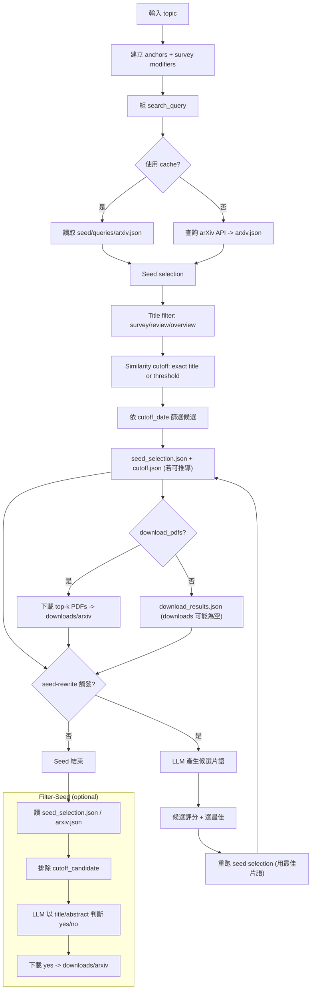

# Seed 流程完整復盤（現行實作）

本文件以 **現行程式碼** 為準，完整描述 seed 階段的輸入、流程、分歧與產物，並附上流程圖（Mermaid）。

> 範圍：`python scripts/topic_pipeline.py seed`（以及後續可選的 `filter-seed`）。  
> 來源：`src/pipelines/topic_pipeline.py`、`scripts/topic_pipeline.py`。

---

## 1) 輸入與核心參數

- `topic`：主題字串（唯一必要輸入）
- `--anchor-mode`：`phrase | token_and | token_or | core_phrase | core_token_or`
- `--anchor-operator`：`AND | OR`（只作用在 anchors 之間）
- `--boolean-operator`：`AND | OR`（連接 anchors 與 survey modifiers）
- `--scope`：`all | ti | abs`（查詢欄位）
- `--max-results`：arXiv 查詢上限（預設 25）
- `--download-top-k`：下載上限（預設 5）
- `--download-pdfs`：seed 階段是否下載 PDF（預設不下載）
- `--seed-rewrite` 與相關旗標：啟用 seed query 改寫（預設關閉）
- `--no-cache`：忽略 `seed/queries/arxiv.json`（預設重用）

---

## 2) 核心輸出與檔案

- `workspaces/<topic_slug>/seed/queries/arxiv.json`：arXiv 搜尋回傳（Atom 轉 dict）
- `workspaces/<topic_slug>/seed/queries/seed_selection.json`：候選與 cutoff 結果
- `workspaces/<topic_slug>/seed/queries/seed_rewrite.json`：改寫過程（若觸發）
- `workspaces/<topic_slug>/seed/downloads/download_results.json`：下載結果（可能為空）
- `workspaces/<topic_slug>/seed/downloads/arxiv/*.pdf`：seed PDF（`--download-pdfs` 或 filter-seed 才會產生）
- `workspaces/<topic_slug>/cutoff/cutoff.json`：由 seed_selection 推導出的 cutoff（若有）

---

## 3) 現行流程（逐步）

1) **建立 anchors / modifiers**
   - `anchors`：預設 `default_topic_variants(topic)`；`core_*` 模式改用核心片語。
   - `survey modifiers`：預設 `survey/review/overview/systematic review/systematic literature review/scoping review/mapping study/tutorial`。

2) **組 query**
   - `anchor_clause`：依 `anchor_mode` 決定 phrase / token_and / token_or。
   - `anchor_operator`：決定 anchors 之間如何用 AND/OR 串接。
   - `search_clause`：survey modifiers 以 phrase clause 串接。
   - `search_query = (anchor_clause) <boolean_operator> (search_clause)`。

3) **查詢 arXiv（可重用 cache）**
   - 若未加 `--no-cache` 且 `seed/queries/arxiv.json` 存在 → 直接重用。
   - 否則呼叫 arXiv API，並寫入 `seed/queries/arxiv.json`。

4) **Seed selection（含 cutoff）**
   - Title filter：只保留標題含 `survey/review/overview` 的紀錄。
   - Similarity cutoff：
     - 先找 **與 topic 同標題** 的 survey。
     - 若無，找相似度 ≥ 門檻（預設 0.8）者作為 cutoff candidate。
   - 依 cutoff_date 篩出較早的候選；若全部被 cutoff 移除，記錄 `cutoff_removed_all_candidates`。
   - 產出 `seed_selection.json`（含 `candidates` / `download_selected` / `cutoff_candidate` / `cutoff_reason`）。
   - 若能推導 cutoff → 寫入 `cutoff/cutoff.json`。

5) **Seed 下載（選用）**
   - 若有 `--download-pdfs`：
     - 下載 `download_top_k` 篇到 `seed/downloads/arxiv/`。
   - 不下載時：
     - `download_results.json` 仍會生成，但 downloads 可能為空。

6) **Seed rewrite（選用）**
   - 觸發條件：
     - `records_after_filter == 0` 或 `cutoff_removed_all_candidates`。
     - 若有下載且 PDF 為空，也會觸發。
   - 觸發後：
     - LLM 產生候選片語 → 評分 → 選最佳候選。
     - 以**最佳候選片語**重新組 query 並再跑一次 seed selection。
     - 寫入 `seed_rewrite.json`，並更新 `seed_selection.json` / `download_results.json`。

7) **Filter-Seed（可選，獨立 stage）**
   - 只用 title/abstract 篩選（**不讀 PDF**）。
   - 讀取 `seed_selection.json` / `arxiv.json` 取得候選。
   - **若有 `cutoff_candidate`，會排除該篇，避免回流**。
   - 對通過者下載 PDF 至 `seed/downloads/arxiv/`。

---

## 4) 流程圖（Mermaid）

---

## 5) 注意事項

- `cutoff_by_similar_title` 在程式內固定啟用（`--no-cutoff-by-similar-title` 會被忽略）。
- 改寫後的片語會**覆蓋**原本 anchors，並依 `anchor_mode` 再次組 query。
- `filter-seed` 只用 metadata；**不依賴 seed 階段是否已下載 PDF**。
